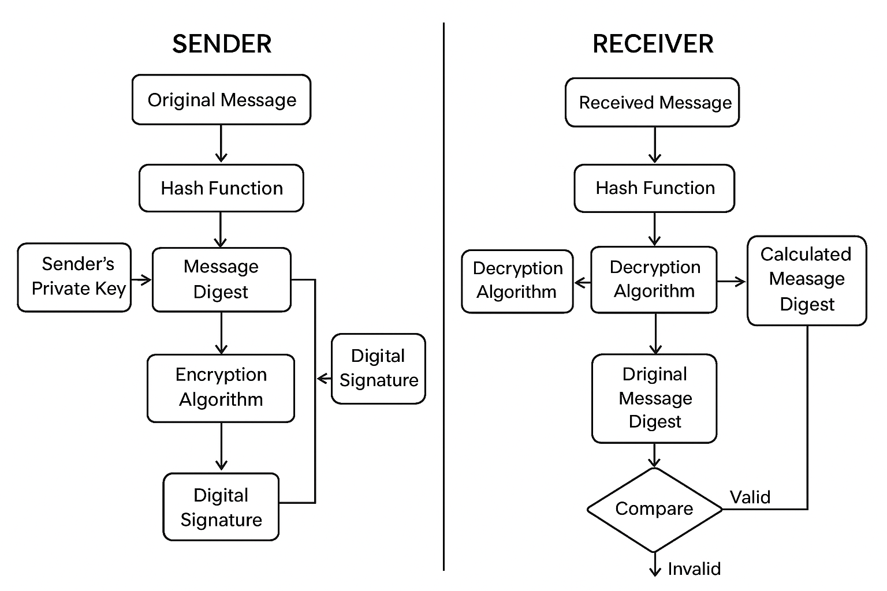

# Project: Digital Signatures

[](https://www.python.org/)
[](https://pycryptodome.readthedocs.io/en/latest/)

## Table of Contents

- [Introduction](#introduction)
- [What are Digital Signatures?](#what-are-digital-signatures)
- [Role in Cybersecurity](#role-in-cybersecurity)
- [Project Overview](#project-overview)
  - [Goals](#goals)
  - [Technologies Used](#technologies-used)
- [How it Works](#how-it-works)
  - [1. Key Generation](#1-key-generation)
  - [2. Message Hashing](#2-message-hashing)
  - [3. Signing the Hash](#3-signing-the-hash)
  - [4. Verification](#4-verification)
  - [5. Tamper Detection](#5-tamper-detection)
- [How to Run This Project](#how-to-run-this-project)
  - [Prerequisites](#prerequisites)
  - [Setup](#setup)
  - [Running the Scripts](#running-the-scripts)
    - [Generate Keys](#generate-keys)
    - [Sign a Message](#sign-a-message)
    - [Verify a Signature](#verify-a-signature)
- [Sample Output](#sample-output)
- [Visuals](#visuals)
- [References](#references)

## Introduction

This project demonstrates the implementation of digital signatures using asymmetric cryptography. It showcases how digital signatures can be used to ensure message authenticity, integrity, and non-repudiation.

## What are Digital Signatures?

A digital signature is a mathematical scheme for verifying the authenticity of digital messages or documents. A valid digital signature, where the prerequisites are satisfied, gives a recipient very strong reason to believe that the message was created by a known sender (authenticity), and that the message was not altered in transit (integrity). Digital signatures also provide non-repudiation, meaning that the signer cannot successfully claim they did not sign a message, while also claiming their private key remains secret.

## Role in Cybersecurity

Digital signatures play a crucial role in various aspects of cybersecurity:

*   **Software Integrity:** Ensuring that software downloaded or installed has not been tampered with by malicious actors. Developers sign their software releases, and users' systems can verify these signatures before execution.
*   **Secure Email (S/MIME, PGP):** Verifying the sender of an email and ensuring the content hasn't been altered.
*   **Financial Transactions:** Authenticating parties involved in online transactions and ensuring the integrity of transaction data.
*   **Legal Documents:** Providing a secure and verifiable way to sign electronic documents, making them legally binding in many jurisdictions.
*   **Non-repudiation:** Providing proof that a specific party sent a message or authorized a transaction, preventing them from later denying it.
*   **Code Signing:** Authenticating the source and integrity of executable code, scripts, and software updates.
*   **Secure Communication Protocols (SSL/TLS):** Digital certificates, which contain digital signatures, are fundamental to establishing secure and authenticated communication channels over the internet.

## Project Overview

### Goals

*   To implement the core components of a digital signature scheme: key generation, message signing, and signature verification.
*   To use asymmetric cryptography (RSA) for signing and verification.
*   To demonstrate how digital signatures can detect tampering with messages.
*   To provide a clear explanation of the concepts and the implementation.

### Technologies Used

*   **Python:** The primary programming language for implementation.
*   **PyCryptoDome:** A powerful Python library for cryptographic operations, including RSA key generation, hashing (SHA-256), and digital signatures.

## How it Works

The process of creating and verifying a digital signature involves several steps:

### 1. Key Generation

Asymmetric cryptography relies on a pair of keys: a private key and a public key.
*   **Private Key:** Kept secret by the owner. Used to create the digital signature.
*   **Public Key:** Freely distributable. Used by anyone to verify the digital signature.

This project includes a script (`generate_keys.py`) to generate an RSA key pair.

### 2. Message Hashing

Before signing, the original message is passed through a cryptographic hash function (e.g., SHA-256). This produces a fixed-size string of characters, known as a hash digest or message digest. Hashing ensures that:
*   Even a small change in the message will result in a significantly different hash.
*   It is computationally infeasible to find two different messages that produce the same hash (collision resistance).
*   It is computationally infeasible to reverse the hash to get the original message.

### 3. Signing the Hash

The sender uses their **private key** to encrypt the hash digest. The encrypted hash, along with the original message (or just the signature itself, depending on the protocol), constitutes the digital signature.

### 4. Verification

To verify the signature, the recipient performs the following steps:
1.  Obtains the sender's **public key**.
2.  Uses the public key to decrypt the signature, retrieving the original hash digest (let's call this Hash_S).
3.  Independently computes the hash digest of the received message using the same hash function used by the sender (let's call this Hash_R).
4.  Compares Hash_S and Hash_R. If they are identical, the signature is valid. This means:
    *   **Authenticity:** The message was signed by the owner of the private key corresponding to the public key used for verification.
    *   **Integrity:** The message has not been altered since it was signed.

### 5. Tamper Detection

If the message is altered in transit after being signed, the hash computed by the recipient (Hash_R) will not match the hash decrypted from the signature (Hash_S). This mismatch indicates that the message has been tampered with, and the signature will be deemed invalid.

## How to Run This Project

### Prerequisites

*   Python 3.9 or higher.
*   `pip` (Python package installer).

### Setup

1.  **Clone the repository (or navigate to this project folder if already cloned):**
    ```bash
    # git clone <repository_url>
    # cd Cybersecurity-Portfolio/Digital_Signatures
    ```
2.  **Install the required Python library:**
    ```bash
    pip install pycryptodome
    ```

### Running the Scripts

The project consists of three main Python scripts:

1.  `generate_keys.py`: Generates a new RSA public/private key pair.
2.  `sign_message.py`: Signs a given message using a private key.
3.  `verify_message.py`: Verifies a signature against a message using a public key.

#### Generate Keys

This script will create `private_key.pem` and `public_key.pem` in the current directory.

```bash
python generate_keys.py
```

#### Sign a Message

This script requires a message file and the private key. It will output a signature file.

First, create a sample message file, for example `message.txt`:
```
Hello, this is a secret message to be signed.
```

Then, run the signing script:
```bash
python sign_message.py message.txt private_key.pem signature.sig
```
This will create `signature.sig` containing the digital signature.

#### Verify a Signature

This script requires the original message file, the signature file, and the public key.

```bash
python verify_message.py message.txt public_key.pem signature.sig
```
The script will output whether the signature is valid or not.

**To demonstrate tamper detection:**

1.  Sign `message.txt` as shown above.
2.  Modify `message.txt` (e.g., change a word or add a character).
3.  Try to verify the original `signature.sig` against the modified `message.txt` using `public_key.pem`.
The verification should fail.

## Sample Output

Below are example console outputs for key generation, signing, successful verification, and failed verification due to tampering.

**1. Key Generation (`python generate_keys.py`):**
```
Key saved to private_key.pem
Key saved to public_key.pem
RSA key pair generated successfully.
Private key stored in private_key.pem
Public key stored in public_key.pem
```

**2. Creating a sample message (`message.txt`):**
```
This is a sample message for the Digital Signatures project.
It will be used to demonstrate signing and verification, as well as tamper detection.
```

**3. Signing the Message (`python sign_message.py sample_message.txt private_key.pem original_signature.sig`):**
```
Message signed successfully. Signature saved to original_signature.sig
```

**4. Verifying the Original Signature (`python verify_message.py sample_message.txt public_key.pem original_signature.sig`):**
```
Signature is valid.
```

**5. Tampering with the message (e.g., create `tampered_message.txt`):**
```
This is a sample message for the Digital Signatures project.
It has been TAMPERED WITH to demonstrate tamper detection.
```

**6. Verifying with Tampered Message (`python verify_message.py tampered_message.txt public_key.pem original_signature.sig`):**
```
Signature is invalid.
```

## Visuals

The following diagram illustrates the digital signature creation and verification process:



This flowchart shows:
*   **Sender Side:** Original Message -> Hash Function -> Digest -> Encrypt with Private Key -> Digital Signature.
*   **Receiver Side:** Digital Signature -> Decrypt with Public Key -> Original Digest. Received Message -> Hash Function -> New Digest. Compare Digests -> Valid/Invalid.


## References

*   [PyCryptoDome Documentation](https://pycryptodome.readthedocs.io/en/latest/)
*   [RFC 3447: Public-Key Cryptography Standards (PKCS) #1: RSA Cryptography Specifications Version 2.1](https://datatracker.ietf.org/doc/html/rfc3447)


