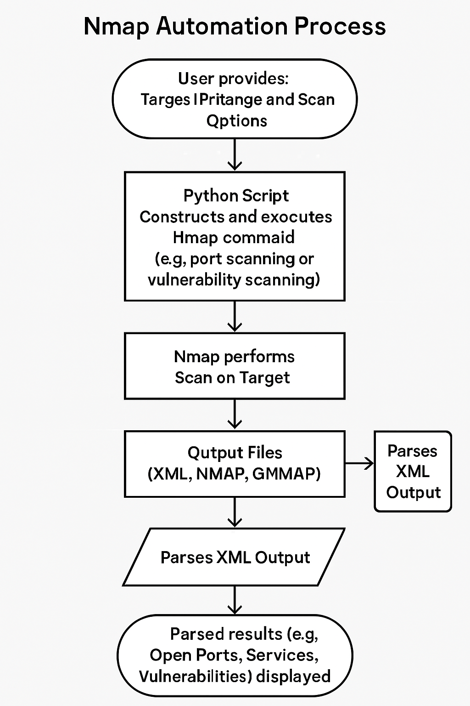

# Project: Nmap Network Scanning Automation

[](https://www.python.org/)
[](https://nmap.org/)

## Table of Contents

- [Introduction](#introduction)
- [The Importance of Reconnaissance](#the-importance-of-reconnaissance)
- [Project Goals](#project-goals)
- [Features](#features)
- [Technologies Used](#technologies-used)
- [How to Run This Project](#how-to-run-this-project)
  - [Prerequisites](#prerequisites)
  - [Setup](#setup)
  - [Running the Scripts](#running-the-scripts)
    - [Port Scanning Script (`port_scanner.py`)](#port-scanning-script-port_scannerpy)
    - [Vulnerability Scanning Script (`vuln_scanner.py`)](#vulnerability-scanning-script-vuln_scannerpy)
- [Sample Scan Scenarios & Findings](#sample-scan-scenarios--findings)
  - [Scanning `scanme.nmap.org`](#scanning-scanmenmaporg)
  - [Explanation of Findings](#explanation-of-findings)
- [Visuals (Example Output)](#visuals-example-output)
- [Ethical Considerations](#ethical-considerations)
- [References](#references)

## Introduction

This project focuses on automating network scanning tasks using Nmap (Network Mapper) and Python. It demonstrates how scripting can enhance the efficiency and effectiveness of reconnaissance, a critical phase in ethical hacking and penetration testing. The scripts provided automate port scanning and basic vulnerability detection, along with parsing and saving the results for analysis.

## The Importance of Reconnaissance

Reconnaissance is the initial and one of the most crucial phases in any ethical hacking or penetration testing engagement. It involves gathering as much information as possible about the target system or network. Effective reconnaissance helps in:

*   Identifying Live Hosts
*   Enumerating Open Ports and Services
*   Operating System Detection
*   Vulnerability Identification
*   Mapping Network Topology

Automating these reconnaissance tasks with tools like Nmap and Python allows security professionals to cover larger networks more quickly, consistently apply scanning methodologies, and efficiently process the gathered data to identify potential attack vectors.

## Project Goals

*   To develop Python scripts that automate Nmap scans for port discovery and vulnerability assessment.
*   To implement functionality for parsing Nmap output.
*   To demonstrate how to save and structure scan results for later analysis.
*   To provide examples of scans and explain the findings.
*   To highlight the importance of reconnaissance in cybersecurity.

## Features

*   Automated TCP port scanning (e.g., common ports, full range).
*   Automated basic vulnerability scanning using Nmap Scripting Engine (NSE).
*   Parsing of Nmap XML output to extract key information.
*   Saving scan results in structured formats.

## Technologies Used

*   **Python:** For scripting the automation logic.
*   **Nmap:** The core network scanning tool.
*   **xml.etree.ElementTree (Python standard library):** For parsing Nmap XML output.

## How to Run This Project

### Prerequisites

*   Python 3.9 or higher.
*   `pip` (Python package installer).
*   Nmap installed and in your system PATH. You can download Nmap from [nmap.org](https://nmap.org/download.html).

### Setup

1.  **Clone/Download the repository and navigate to this project folder:**
    ```bash
    # Example: cd Cybersecurity-Portfolio/Nmap_Network_Scanning_Automation
    ```
2.  **Ensure Python dependencies are met (PyCryptoDome is not directly used by these scripts but might be in your environment from other projects).**

### Running the Scripts

The project consists of two main Python scripts:

1.  `port_scanner.py`: Scans for open ports and services.
    *   **Usage:** `python port_scanner.py <target_host> [nmap_options]`
    *   **Example:** `python port_scanner.py scanme.nmap.org -oX port_scan_results.xml` (saves output to XML)

2.  `vuln_scanner.py`: Performs vulnerability scanning using Nmap NSE scripts.
    *   **Usage:** `python vuln_scanner.py <target_host> --scripts <script_category_or_list> [other_nmap_options]`
    *   **Example:** `python vuln_scanner.py scanme.nmap.org --scripts default,vuln -oX vuln_scan_results.xml` (runs default and vulnerability scripts, saves to XML)

Output files (XML, NMAP, GNMAP) will be generated in the script's directory.

## Sample Scan Scenarios & Findings

### Scanning `scanme.nmap.org`

For demonstration, let's consider scanning `scanme.nmap.org` (a service provided by the Nmap project for testing).

**1. Port Scanning with `port_scanner.py`:**

Command used (example):
```bash
python port_scanner.py scanme.nmap.org -sS -T4 -A -v -oX scanme_port_scan_results.xml
```

**Expected Output (summary, actual output will be more verbose):**
*   List of open TCP ports (e.g., 22/tcp, 80/tcp).
*   Services running on those ports (e.g., OpenSSH, Apache httpd).
*   Operating system information (e.g., Linux variant).
*   Traceroute information.

**2. Vulnerability Scanning with `vuln_scanner.py`:**

Command used (example):
```bash
python vuln_scanner.py scanme.nmap.org --scripts vuln --oX scanme_vuln_scan_results.xml
```

**Expected Output (summary, actual output will be more verbose and depend on the scripts run):**
*   Information about discovered services.
*   Results from NSE scripts. For example, if the `vulners` script is part of the category (or run explicitly), it might report known CVEs associated with the versions of software detected on open ports.
*   Other scripts might check for default credentials, misconfigurations, or specific known vulnerabilities.

### Explanation of Findings

When scanning a target like `scanme.nmap.org`:

*   **Port Scanning (`port_scanner.py`)** would reveal that port 22 (SSH) and port 80 (HTTP) are typically open. It might identify the SSH version as OpenSSH and the webserver as Apache on a Linux system. This information is crucial for an attacker (or a penetration tester) to understand the attack surface.

*   **Vulnerability Scanning (`vuln_scanner.py`)** using scripts like the `vuln` category would attempt to identify known vulnerabilities. For instance:
    *   If an older, unpatched version of OpenSSH were running, specific CVEs might be flagged.
    *   If the Apache server had known vulnerabilities (e.g., related to specific modules or versions), these could be reported.
    *   Scripts might check for common web vulnerabilities like SQL injection or XSS if web services are detected, though Nmap's primary strength isn't full web application scanning.
    *   The `vulners` script, if included, cross-references discovered software versions with vulnerability databases and reports potential CVEs.

The output files (XML, NMAP, GNMAP) generated by these scripts would contain detailed information that can be further analyzed. For example, the XML output can be parsed by other security tools or custom scripts for automated reporting or further investigation.

## Visuals (Example Output)

Visuals are crucial for understanding scan results. The following flowchart illustrates the general automation process:



In a real report, you would also include:

1.  **Screenshots of Terminal Output:** Showing the commands run and the summarized Nmap output for both port scanning and vulnerability scanning phases.
    *   Example: A screenshot showing `nmap -sV -A scanme.nmap.org` results, highlighting open ports and identified services.
2.  **Diagrams:** A network diagram showing the target host and the attacker machine, with arrows indicating the scan traffic. This helps visualize the reconnaissance process.
3.  **Parsed Output Snippets:** Key excerpts from the XML or NMAP files, particularly highlighting critical findings like specific vulnerabilities or unusual open ports.

For instance, after running the scripts, one might generate a summary table:

| IP Address     | Open Port | Service  | Version      | Potential Vulnerabilities (from NSE) |
|----------------|-----------|----------|--------------|--------------------------------------|
| 45.33.32.156   | 22/tcp    | ssh      | OpenSSH 6.6.1| [List potential CVEs if found]       |
| 45.33.32.156   | 80/tcp    | http     | Apache 2.4.7 | [List potential CVEs if found]       |

This structured presentation makes the information more digestible for security assessments.

## Ethical Considerations

**IMPORTANT:** Network scanning can be intrusive and should **ONLY** be performed on networks and systems for which you have explicit, written permission. Unauthorized scanning is illegal and unethical. The scripts and techniques described in this project are for educational purposes and for use in controlled lab environments or authorized penetration testing engagements.

## References

*   [Nmap Official Website](https://nmap.org/)
*   [Nmap Scripting Engine (NSE) Documentation](https://nmap.org/book/nse.html)
*   [Metasploitable 2 Download (for testing)](https://information.rapid7.com/download-metasploitable-2017.html)

