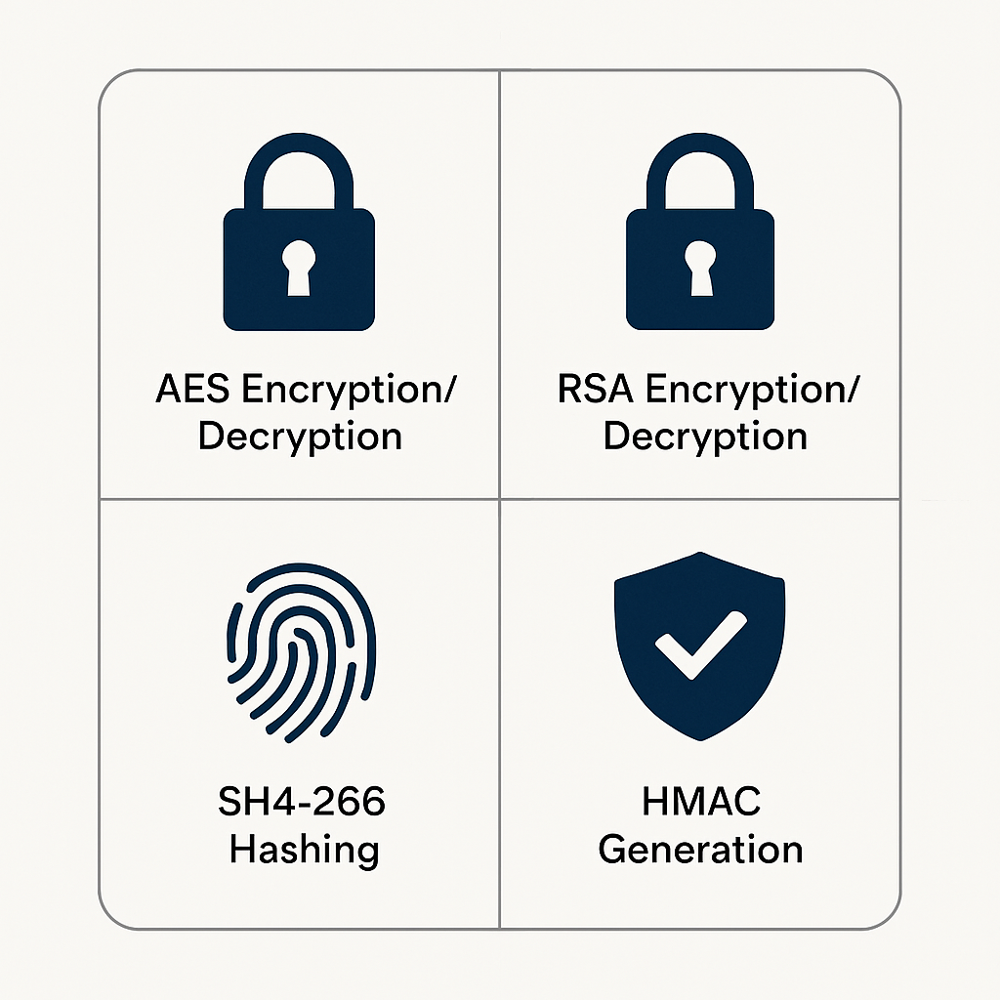

# Project: Cryptography Toolkit

[](https://www.python.org/)
[](https://pycryptodome.readthedocs.io/en/latest/)

## Table of Contents

- [Introduction](#introduction)
- [Project Goals](#project-goals)
- [Features](#features)
- [Symmetric vs. Asymmetric Cryptography](#symmetric-vs-asymmetric-cryptography)
- [Real-World Examples of Cryptographic Methods](#real-world-examples-of-cryptographic-methods)
  - [AES (Advanced Encryption Standard)](#aes-advanced-encryption-standard)
  - [RSA (Rivest-Shamir-Adleman)](#rsa-rivest-shamir-adleman)
  - [SHA-256 (Secure Hash Algorithm 256-bit)](#sha-256-secure-hash-algorithm-256-bit)
  - [HMAC (Hash-based Message Authentication Code)](#hmac-hash-based-message-authentication-code)
- [Technologies Used](#technologies-used)
- [How to Run This Project](#how-to-run-this-project)
  - [Prerequisites](#prerequisites)
  - [Setup](#setup)
  - [Running the Command-Line Tool (`crypto_tool.py`)](#running-the-command-line-tool-crypto_toolpy)
    - [AES Encryption/Decryption](#aes-encryptiondecryption)
    - [RSA Encryption/Decryption](#rsa-encryptiondecryption)
    - [SHA-256 Hashing](#sha-256-hashing)
    - [HMAC Generation](#hmac-generation)
- [Sample Usage and Output](#sample-usage-and-output)
- [Visuals](#visuals)
- [References](#references)

## Introduction

This Cryptography Toolkit is a command-line application that provides users with easy access to common cryptographic operations. It aims to demonstrate the practical application of various encryption, hashing, and message authentication techniques in Python.

## Project Goals

*   To implement a user-friendly command-line interface (CLI) for performing cryptographic tasks.
*   To include functionalities for AES encryption/decryption, RSA encryption/decryption, SHA-256 hashing, and HMAC generation.
*   To provide clear explanations of each cryptographic method and its use cases.
*   To offer a practical tool for learning about and experimenting with cryptography.

## Features

*   **AES Encryption/Decryption:** Symmetric encryption for files or messages.
*   **RSA Encryption/Decryption:** Asymmetric encryption, typically for smaller data like keys or messages (demonstration purposes).
*   **SHA-256 Hashing:** Generate a secure hash of a message or file for integrity checking.
*   **HMAC Generation:** Create a Hash-based Message Authentication Code for verifying both data integrity and authenticity.

## Symmetric vs. Asymmetric Cryptography

| Feature             | Symmetric Cryptography (e.g., AES) | Asymmetric Cryptography (e.g., RSA) |
| ------------------- | ------------------------------------ | --------------------------------------- |
| **Key(s) Used**     | Single shared secret key             | Pair of keys: public and private        |
| **Key Management**  | Challenging (secure key exchange)    | Simpler (public key can be shared openly) |
| **Speed**           | Generally faster                     | Generally slower                        |
| **Data Size**       | Suitable for large amounts of data   | Suitable for small amounts of data (e.g., key exchange, digital signatures) |
| **Primary Use Cases** | Bulk data encryption, secure communication channels (once key is exchanged) | Digital signatures, key exchange, secure email |
| **Examples**        | AES, DES, 3DES, Blowfish             | RSA, ECC (Elliptic Curve Cryptography), Diffie-Hellman |

## Real-World Examples of Cryptographic Methods

### AES (Advanced Encryption Standard)
*   **Securing Files:** Encrypting sensitive documents on your hard drive (e.g., VeraCrypt, BitLocker).
*   **Secure Connections:** Used in protocols like HTTPS (SSL/TLS) to encrypt web traffic between your browser and a server.
*   **Database Encryption:** Protecting data stored in databases.
*   **Mobile Security:** Encrypting data on smartphones and tablets.

### RSA (Rivest-Shamir-Adleman)
*   **Digital Signatures:** Verifying the authenticity and integrity of software, documents, or messages (as seen in the Digital Signatures project).
*   **Secure Key Exchange:** Used in SSL/TLS to securely exchange symmetric keys that will then be used for bulk data encryption with AES.
*   **Secure Email (PGP/GPG):** Encrypting the content of emails or attachments.

### SHA-256 (Secure Hash Algorithm 256-bit)
*   **Password Storage:** Storing hashes of passwords instead of plain text passwords. Often combined with salting.
*   **Data Integrity Verification:** Ensuring that a downloaded file has not been corrupted or tampered with by comparing its hash with a known good hash.
*   **Digital Signatures:** Used to create a message digest before signing (as seen in the Digital Signatures project).
*   **Blockchain Technology:** Used extensively in cryptocurrencies like Bitcoin to secure transactions and blocks.

### HMAC (Hash-based Message Authentication Code)
*   **Message Authentication:** Verifying that a message comes from an authentic source and has not been tampered with during transmission. Used in various network protocols.
*   **API Security:** Ensuring the integrity and authenticity of requests made to an API.
*   **JSON Web Tokens (JWTs):** HMAC algorithms (like HMAC-SHA256) are commonly used to sign JWTs, ensuring they haven't been tampered with.

## Technologies Used

*   **Python:** The primary programming language for implementation.
*   **PyCryptoDome:** A Python library for cryptographic operations.
*   **argparse:** (Potentially) Python library for parsing command-line arguments for the toolkit.

## How to Run This Project

### Prerequisites

*   Python 3.9 or higher.
*   `pip` (Python package installer).

### Setup

1.  **Navigate to this project folder:**
    ```bash
    cd Cybersecurity-Portfolio/Cryptography_Toolkit
    ```
2.  **Install the required Python library (if not already installed from the previous project):**
    ```bash
    pip install pycryptodome
    ```

## Sample Usage and Output

Below are example commands and their outputs for each feature of the toolkit. For brevity, only key commands and their results are shown. The `crypto_tool.py` script provides detailed help via `python crypto_tool.py <command> -h`.

**1. AES Encryption/Decryption**

*   **Generate AES Key:**
    ```bash
    python crypto_tool.py aes genkey --outfile aes_key.bin
    ```
    Output:
    ```
    New 32-byte AES key generated and saved to 'aes_key.bin'. Hex: <actual_generated_aes_key_hex_here_e.g.,_6e812ba9...>
    ```
    (Note: The actual key hex will vary with each generation. The key is stored in `aes_key.bin`.)

*   **Create a sample message (`aes_sample_message.txt`):**
    ```
    This is a secret message for AES encryption testing in the Cryptography Toolkit.
    ```

*   **AES Encrypt:**
    ```bash
    python crypto_tool.py aes encrypt --key aes_key.bin --infile aes_sample_message.txt --outfile aes_encrypted_message.enc
    ```
    Output:
    ```
    File 	'aes_sample_message.txt' encrypted successfully to 'aes_encrypted_message.enc'.
    Nonce, Tag, and Ciphertext saved.
    ```

*   **AES Decrypt:**
    ```bash
    python crypto_tool.py aes decrypt --key aes_key.bin --infile aes_encrypted_message.enc --outfile aes_decrypted_message.txt
    ```
    Output:
    ```
    File 'aes_encrypted_message.enc' decrypted successfully to 'aes_decrypted_message.txt'.
    ```
    Content of `aes_decrypted_message.txt`:
    ```
    This is a secret message for AES encryption testing in the Cryptography Toolkit.
    ```

**2. RSA Encryption/Decryption**

*   **Generate RSA Keys:**
    ```bash
    python crypto_tool.py rsa genkeys --privfile rsa_tk_private.pem --pubfile rsa_tk_public.pem
    ```
    Output:
    ```
    RSA private key saved to rsa_tk_private.pem
    RSA public key saved to rsa_tk_public.pem
    ```

*   **Create a sample message (`rsa_sample_message.txt`):**
    ```
    RSA test message.
    ```

*   **RSA Encrypt:**
    ```bash
    python crypto_tool.py rsa encrypt --pubkey rsa_tk_public.pem --infile rsa_sample_message.txt --outfile rsa_encrypted_message.bin
    ```
    Output:
    ```
    File 'rsa_sample_message.txt' encrypted successfully to 'rsa_encrypted_message.bin' using RSA.
    ```

*   **RSA Decrypt:**
    ```bash
    python crypto_tool.py rsa decrypt --privkey rsa_tk_private.pem --infile rsa_encrypted_message.bin --outfile rsa_decrypted_message.txt
    ```
    Output:
    ```
    File 'rsa_encrypted_message.bin' decrypted successfully to 'rsa_decrypted_message.txt' using RSA.
    ```
    Content of `rsa_decrypted_message.txt`:
    ```
    RSA test message.
    ```

**3. SHA-256 Hashing**

*   **Hash a file (`aes_sample_message.txt`):**
    ```bash
    python crypto_tool.py sha256 aes_sample_message.txt
    ```
    Output:
    ```
    SHA-256 Hash of 'aes_sample_message.txt': e9a90a060f07dc24d18bd8bfa9f0f44886394caad2c0d5fc8ac155412dea2a12
    ```

**4. HMAC Generation (HMAC-SHA256)**

*   **Generate HMAC Key:**
    ```bash
    python crypto_tool.py hmac genkey --outfile hmac_key.bin
    ```
    Output:
    ```
    New 32-byte HMAC key generated and saved to 'hmac_key.bin'. Hex: <actual_generated_hmac_key_hex_here_e.g.,_806b2129...>
    ```
    (Note: The actual key hex will vary. The key is stored in `hmac_key.bin`.)

*   **Generate HMAC Tag for `aes_sample_message.txt`:**
    ```bash
    python crypto_tool.py hmac generate --key hmac_key.bin --infile aes_sample_message.txt --outfile hmac_tag.txt
    ```
    Output:
    ```
    HMAC-SHA256 for 'aes_sample_message.txt' saved to 'hmac_tag.txt': 31384bc45e0183950cbb7ddf163822b86ebea2349978bd694ccc4fd819e14ae7
    ```
    (Note: The HMAC tag will depend on the generated `hmac_key.bin` and the input file.)

## Visuals

The following diagram provides a conceptual overview of the Cryptography Toolkit's functionalities:



This diagram shows the main operations supported: AES Encryption/Decryption, RSA Encryption/Decryption, SHA-256 Hashing, and HMAC Generation.

## References

*   [PyCryptoDome Documentation](https://pycryptodome.readthedocs.io/en/latest/)
*   [NIST Cryptographic Standards and Guidelines](https://csrc.nist.gov/publications/)


